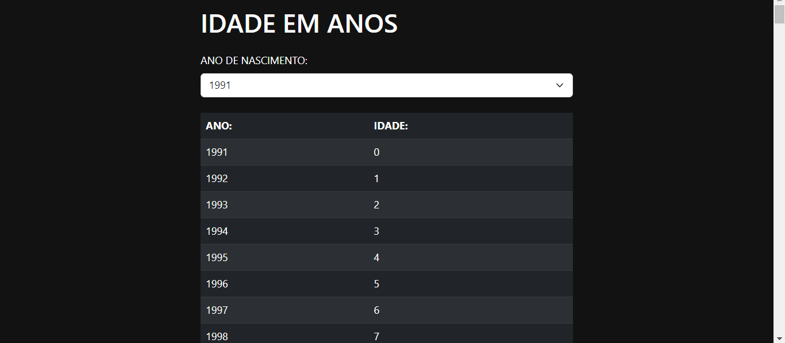

# IDADE EM ANOS
👨‍🏫ESSE PROJETO PERMITE AO USUÁRIO VISUALIZAR COMO SUA IDADE EVOLUI AO LONGO DOS ANOS, OFERECENDO INSIGHTS INTERESSANTES SOBRE O PASSAR DO TEMPO.

  

## DESCRIÇÃO:
O projeto `IDADE EM ANOS` é uma aplicação simples desenvolvida utilizando HTML, CSS com tema escuro usando Bootstrap, e JavaScript. Ele permite ao usuário selecionar o ano de nascimento através de um menu suspenso e exibe uma tabela dinâmica mostrando a idade correspondente para cada ano desde o ano de nascimento até 200 anos no futuro.

## FUNCIONALIDADES:
1. **Seleção do Ano de Nascimento:**
   - O usuário pode escolher o ano de nascimento utilizando um menu suspenso que vai de 1900 até o ano atual + 200.

2. **Exibição da Idade ao Longo dos Anos:**
   - Após selecionar o ano de nascimento, uma tabela é gerada dinamicamente exibindo cada ano desde o ano de nascimento até 200 anos no futuro.
   - Cada linha da tabela mostra o ano e a idade correspondente naquele ano.

## COMO USAR?
1. **Abrir a Aplicação:**
   - Abra o arquivo `./CODIGO/CODIGO.html` em qualquer navegador web moderno.

2. **Selecionar o Ano de Nascimento:**
   - No formulário apresentado, escolha o ano de nascimento através do menu suspenso.

3. **Visualizar as Idades:**
   - Após selecionar o ano de nascimento, a tabela abaixo será automaticamente preenchida com os anos e as idades correspondentes.
   - A tabela é atualizada em tempo real conforme você seleciona diferentes anos de nascimento.

## NÃO SABE?
- Entendemos que para manipular arquivos em `HTML`, `CSS` e outras linguagens relacionadas, é necessário possuir conhecimento nessas áreas. Para auxiliar nesse aprendizado, oferecemos cursos gratuitos disponíveis:
* [CURSO DE HTML E CSS](https://github.com/VILHALVA/CURSO-DE-HTML-E-CSS)
* [CURSO DE JAVASCRIPT](https://github.com/VILHALVA/CURSO-DE-JAVASCRIPT)
* [CURSO DE BOOTSTRAP](https://github.com/VILHALVA/CURSO-DE-BOOTSTRAP)
* [CONFIRA MAIS CURSOS](https://github.com/VILHALVA?tab=repositories&q=+topic:CURSO)

## CREDITOS:
- [PROJETO CRIADO PELO VILHALVA](https://github.com/VILHALVA)

